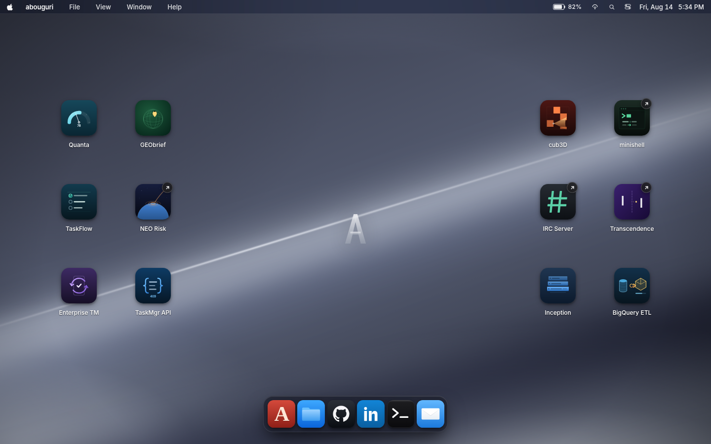
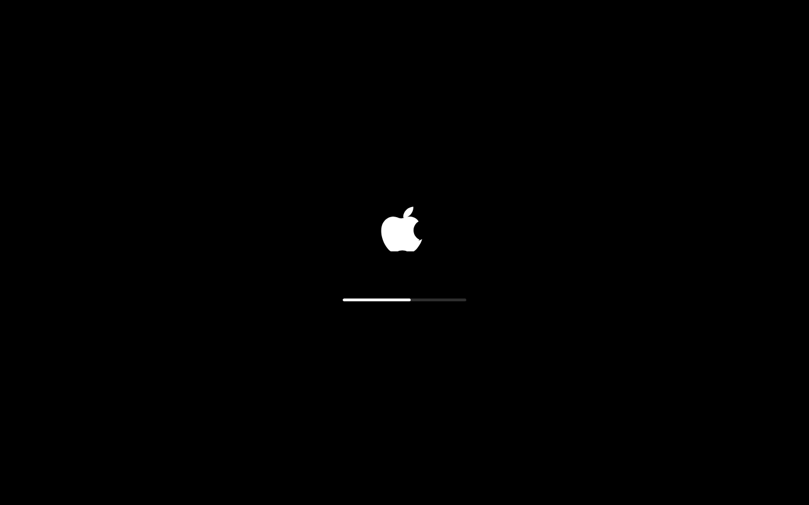
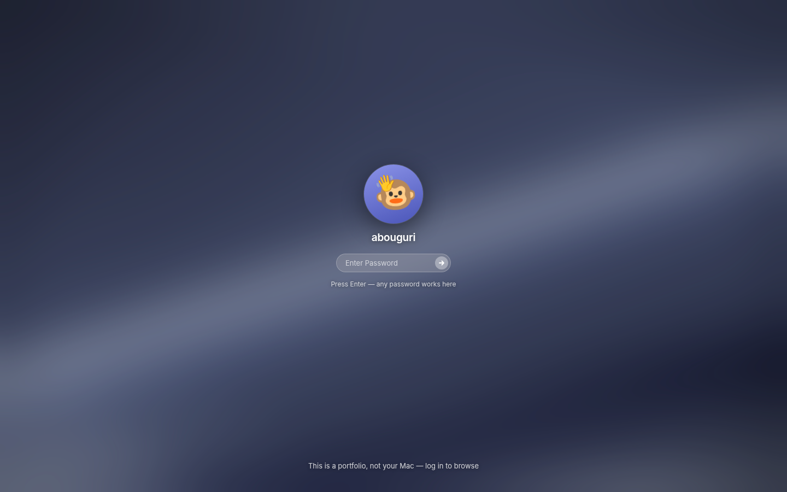
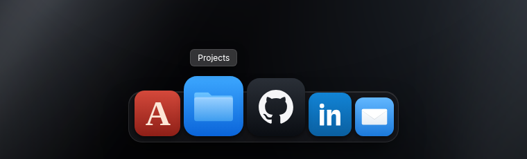
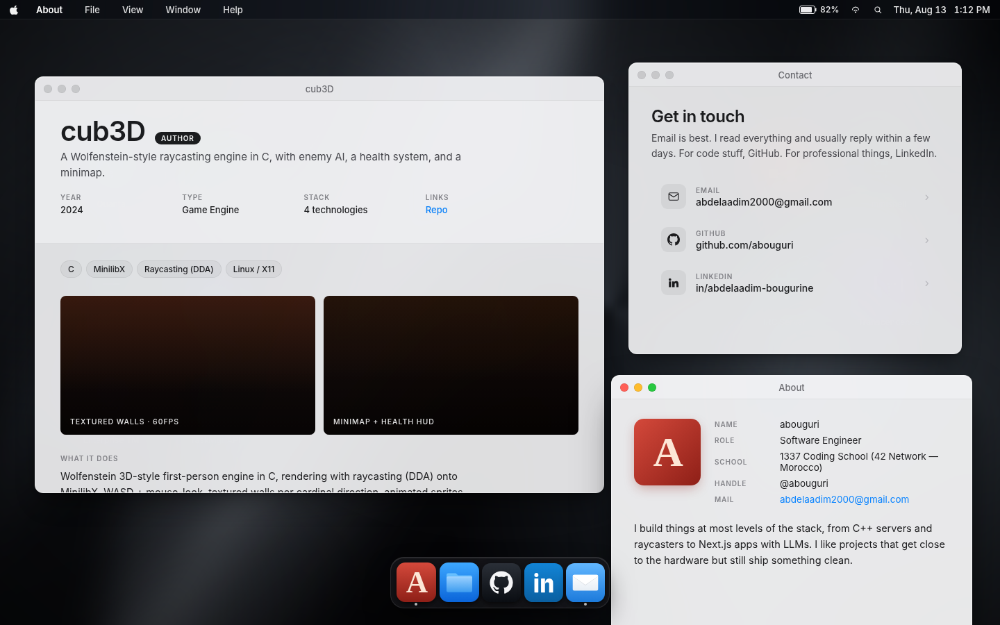
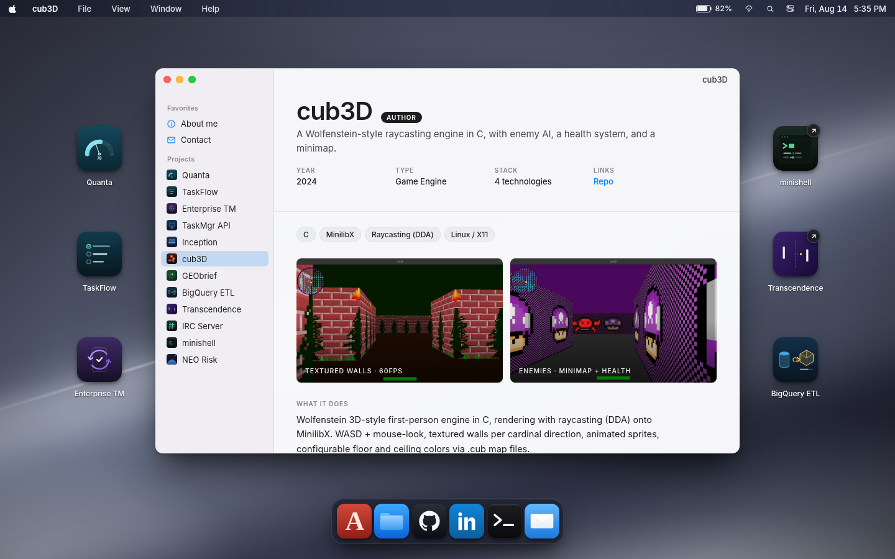
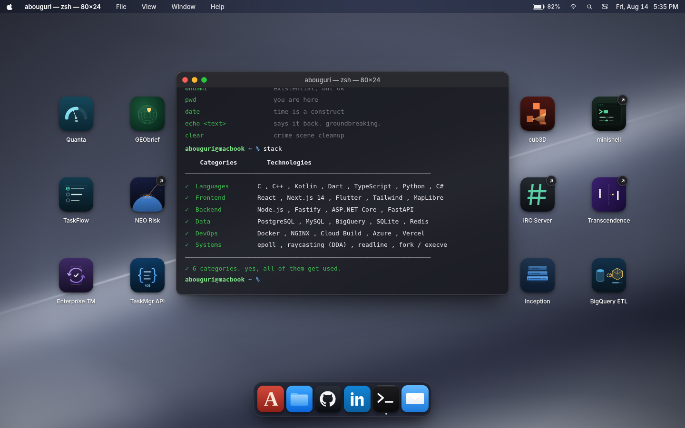
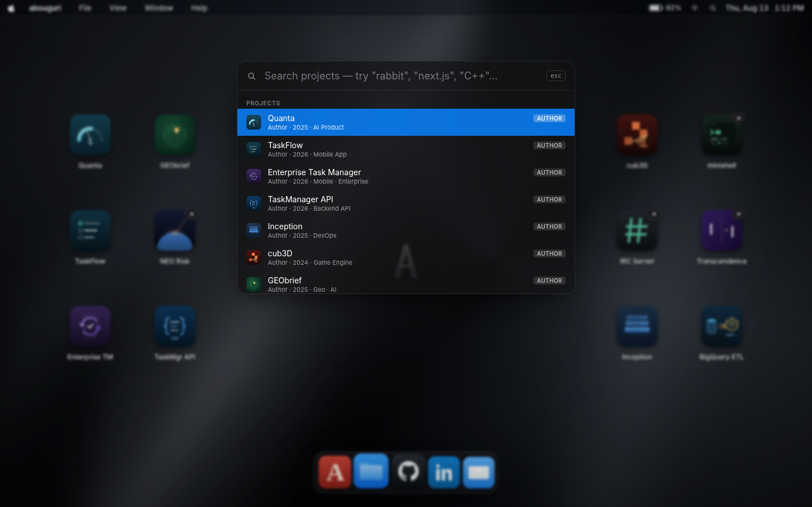
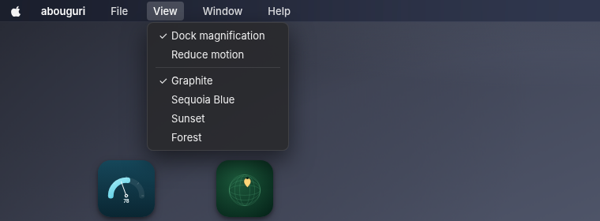
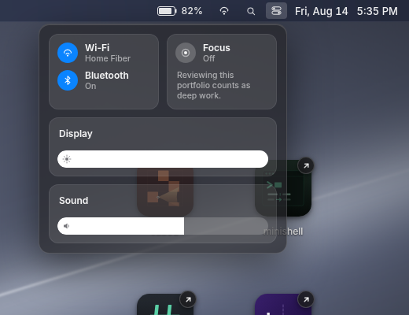

<div align="center">

# macOS Portfolio

**A personal portfolio that behaves like a desktop.**

It boots. It asks you to log in. Then you get draggable icons, a real
cosine-magnification dock, resizable windows that minimise into the dock, a
Finder that browses the projects, a working Terminal, and ⌘K search over the
tech stack. No build step, no framework CLI, no `node_modules` — just open
`index.html`.

</div>



---

## Contents

- [What it is](#what-it-is)
- [The pieces](#the-pieces)
  - [Boot and login](#boot-and-login)
  - [Dock](#dock--cosine-magnification)
  - [Windows](#windows--stacking-focus-resize-minimise)
  - [Finder](#finder--browsing-the-projects)
  - [Terminal](#terminal)
  - [Spotlight](#spotlight--k)
  - [Menu bar and Control Center](#menu-bar-and-control-center)
- [Running it](#running-it)
- [Project structure](#project-structure)
- [Making it yours](#making-it-yours)
- [How the tricky parts work](#how-the-tricky-parts-work)
- [Known gaps](#known-gaps)
- [Product audit and icon review](#product-audit-and-icon-review)

---

## What it is

A portfolio site built as a macOS desktop. Each project is an icon you can drag
around; double-click one and it opens in a window with the stack, a writeup, and
links to the repo and live demo. The layout you arrange persists across reloads.

It runs entirely in the browser with **zero build tooling**. React and Babel come
from a CDN, JSX is transpiled in the page, and every component registers itself on
`window`. That is a deliberate constraint: the whole thing is a handful of CSS and
JS files you can read top to bottom, and deploying is copying a folder.

| | |
|---|---|
| **Stack** | React 18 (UMD) · Babel Standalone · vanilla CSS |
| **Build step** | None |
| **Dependencies** | None installed — 3 CDN `<script>` tags |
| **Total size** | ~163 KB of source, 460 KB of assets |
| **Projects** | 14, each one object in `data.js` |

---

## The pieces

### Boot and login

<table>
<tr>
<td width="50%"></td>
<td width="50%"></td>
</tr>
</table>

A cold load starts on black, fades in an Apple logo, and fills a progress bar
over about four and a half seconds — with a deliberate stall around 55%, because
real firmware never fills linearly. A soft major chord plays through WebAudio if
the browser allows it. Click anywhere to skip.

Then a login screen over the blurred wallpaper. The avatar is a monkey covering
his eyes; hover him and he peeks out, waves, and dances. Any password works, or
click the avatar. Once you unlock, the menu bar drops in from the top and the
dock rises from the bottom.

If you would rather not sit through it, `Desktop` takes a `bootMode` prop:
`full` (default), `login-only`, or `skip`.

### Dock — cosine magnification



The real macOS magnification curve, not a CSS `:hover { transform: scale() }`
approximation. Icon scale follows a cosine falloff around the cursor, so
neighbours swell smoothly instead of popping, and the pill re-flows its width
every frame to fit them.

The whole animation runs in a `requestAnimationFrame` loop that writes `left` /
`width` / `height` **directly to the DOM** through refs. React never re-renders
during the animation — it only re-renders when the hover tooltip changes. Icon
size, max scale, and falloff width are all computed from viewport size, so the
dock scales sensibly from phone to ultrawide.

Open windows get a dot under their tile. Clicking bounces the icon.

### Windows — stacking, focus, resize, minimise



Windows cascade as they open, drag by the title bar, and raise on click via a
monotonic z-counter. The focused window gets full-strength chrome; the ones
behind it fade back. All three traffic lights do their own job now: red closes,
green toggles maximize (double-clicking the title bar does too), and yellow
scales the window down toward the dock, where it parks in a tray beside it until
you click it back. Eight handles resize from any edge or corner, with a
380×260 floor. Opening a project that is already open focuses the existing
window instead of duplicating it.

Windows also come in three flavours: the Finder browser, a dark Terminal, and
plain panels for About and Contact.

### Finder — browsing the projects



Opening a project no longer opens a bare page — it opens a Finder window with a
sidebar listing every project plus About and Contact. Clicking a row swaps the
content pane in place and retitles the window, so you can walk the whole
portfolio without opening every project window. The sidebar runs up under the title
bar the way real Finder does.

Each project pane is generated from one data object: role pill (Author /
Contributor), year, type, stack chip row, screenshots of the project itself, a
*What it does* / *Why it's interesting* writeup, and CTAs to the repo and the
live demo. Contributor projects get an extra *My contributions* section — but
only once you've actually written it (see [Making it yours](#making-it-yours)).

Screenshots are pulled from each project's own repo, downscaled and served as
WebP from `assets/screenshots/`. A project with no captures yet falls back to its
gradient panel rather than breaking the layout, and one with a single capture
spans the full row instead of leaving a hole.

### Terminal



A real micro-shell, not a prop. It auto-types `help` on open, then hands you a
prompt with command history on the arrow keys. `ls` lists all projects by
id, `open quanta` actually opens that project's Finder window, `stack` prints the
tech table, `wallpaper sunset` redecorates the desktop, and `clear`, `pwd`,
`echo`, `whoami` and `date` behave. `sudo` tells you the incident will be
reported.

The commands that change the desktop reach back through a ref, so the terminal
always calls the current handlers rather than the ones captured when it mounted.

### Spotlight — ⌘K



Press <kbd>⌘</kbd><kbd>K</kbd> (or <kbd>Ctrl</kbd><kbd>K</kbd>) anywhere. Results
group into **Projects / Pages / External** and are fully keyboard-driven — arrows
to move, Enter to open, Esc to dismiss.

The search index covers name, tagline, type, role, **and every stack tag**. So
typing `rabbit` finds Transcendence through "RabbitMQ", `entra` finds both halves
of the Enterprise Task Manager, `monte` finds the NEO visualizer through "Monte
Carlo", and `C++` finds the IRC server. That makes the search useful to a
recruiter who is scanning for a technology rather than a project name.

The Projects tile in the dock opens the same panel pre-filtered to projects only.

### Menu bar and Control Center



Live clock and date, and dropdowns that work. The app-name slot tracks the
focused window, exactly like the real thing. The Window menu lists open windows
and focuses the one you pick; File has a "random project" roll for anyone who
wants a tour. View carries real preferences — dock magnification, reduced
motion, and four wallpapers — which tick in place, keep their menu open while
you set them, and persist to `localStorage`. Escape closes any open menu.



The right side is clickable too. Battery, Wi-Fi and Control Center each open a
frosted popover: the Wi-Fi one lists networks and switches off, and Control
Center has Wi-Fi, Bluetooth and Focus tiles plus display and sound sliders. The
brightness slider genuinely dims the whole page through a fixed veil.

**Other details worth a look:** four wallpapers (graphite, Sequoia blue, sunset,
forest) built entirely from layered CSS gradients — no image files — which
parallax against the cursor and respect `prefers-reduced-motion`; rubber-band
selection across the desktop; and a contributor badge on icons for projects you
didn't author.

---

## Running it

There is no build. But `index.html` loads the `.jsx` files over `fetch`, so
opening it as a `file://` URL will fail CORS — serve the folder:

```bash
git clone git@github.com:abouguri/macOS-portfolio.git
cd macOS-portfolio
python3 -m http.server 8000
```

Then open <http://localhost:8000>. Any static server works (`npx serve`,
`php -S`, Live Server, whatever you have).

Deploying is the same idea: push the folder to GitHub Pages, Netlify, Vercel, or
any static host. No build command, no output directory.

> **A note on production:** the page loads React's *development* UMD builds and
> transpiles JSX in the browser on every load. That is great for hacking on it
> and costs a few hundred ms on first paint. If you care, swap in the
> `production.min.js` React builds and pre-compile the JSX with Babel.

---

## Project structure

```
index.html              Script tags, CDN deps, mounts <Desktop/>
data.js                 ← everything you edit lives here
├── ABOUT               Name, role, bio, links
├── PROJECTS[]          One object per project (icon, stack, writeup, position)
├── DOCK_APPS[]         Dock tiles: window / spotlight / external link
└── MENU_STRUCTURE[]    Menu bar dropdowns, toggles, wallpaper radios

Desktop.jsx             Composer. Owns the boot→login→desktop phase, windows,
                        z-order, selection, prefs, shortcuts. Everything opens
                        through one openItem() dispatcher.
├── FabricBackground    Gradient wallpaper + cursor parallax
├── BootLogin           Boot sequence, chime, login screen
├── MenuBar             Clock, dropdowns, Wi-Fi / battery / Control Center
├── DesktopIcon         Drag, select, open; positions persisted
├── Window              Chrome, drag, focus, maximize, resize, minimise
│   ├── WindowContent   Project / About / Contact bodies
│   └── FinderTerminal  Finder sidebar browser + the Terminal shell
├── Spotlight           ⌘K search, grouped + keyboard-driven
└── Dock                Cosine magnification via rAF, minimised-window tray

colors_and_type.css     Design tokens — colors, type scale, spacing, easing
portfolio.css           Layout: desktop, windows, dock, menu bar
portfolio-extras.css    Window content, spotlight, icon states
realism.css             Boot, login, wallpapers, Finder, Terminal, Control
                        Center, resize handles, minimise tray
assets/                 SVG monogram, dock icons, project icons, screenshots
```

Adding a component means writing the file, assigning `window.Foo = Foo` at the
bottom, and adding one `<script type="text/babel">` tag to `index.html`.

---

## Making it yours

**Almost everything lives in [`data.js`](data.js).** Edit that file and reload.

<details>
<summary><b>Add a project</b></summary>

Push an object onto `window.PROJECTS`:

```js
{
  id: "myproject",              // unique; also the window id
  name: "My Project",
  shortName: "My Proj",         // optional — desktop label only, if the name is long
  tagline: "One line that makes someone want to click.",
  role: "Author",               // "Author" or "Contributor"
  year: "2025",
  type: "Systems",              // shown in meta + searchable
  stack: ["Rust", "tokio"],     // chips, and indexed by Spotlight
  repo: "https://github.com/…",
  live: "https://…",            // optional — adds a "Live demo" CTA
  icon: "assets/icons/projects/myproject.svg",
  position: { x: -200, y: 100 },     // offset from the centre of the desktop
  images: [                          // one or two panels above the writeup
    { src: "assets/screenshots/myproject/landing.webp",
      c: "linear-gradient(135deg,#123 0%,#456 100%)",   // shown while loading
      pos: "top",                                        // default "center"
      label: "Landing screen" },
    { c: "linear-gradient(150deg,#234 0%,#567 100%)",    // no src = placeholder
      label: "Detail view" },
  ],
  what: "What it does, plainly.",
  architecture: "How the app is structured.", // optional section
  designSystem: "Tokens, themes and UI conventions.", // optional section
  why:  "Why it's technically interesting.",
}
```

`role: "Contributor"` adds a badge to the desktop icon and unlocks a **My
contributions** section — which stays hidden until you fill in a `contributions`
field that doesn't start with `TODO`. That's intentional: an unwritten
contribution note never ships.

Project icons use a 128×128 SVG viewBox in `assets/icons/projects/`, with a
full-bleed background and the corner radius applied in CSS. Use the project's
existing mark when available, with enough padding to avoid clipping. See the
[icon sources](docs/icon-sources.md) and [size preview](docs/icon-preview.html)
before creating a new illustration.

The desktop label is capped at 112px, so anything much past ~15 characters wants
a `shortName`. The window title always uses the full `name`.

For screenshots, drop WebP files in `assets/screenshots/<project>/`. Panels are
about 370×200, so downscale to ~900px wide — anything larger is wasted bytes.
`fit: "contain"` suits a wide diagram that shouldn't be cropped; `pos: "top"`
suits a portrait phone capture, where the top of the screen is the interesting
part. Give a contained image a light `c` if the image itself has a light
background, so the letterboxing doesn't fight it.
</details>

<details>
<summary><b>Change who you are</b></summary>

`window.ABOUT` in `data.js` drives the About window, the Contact window, the menu
bar name, and the `mailto:` links. Swap `assets/monogram.svg` for the letter
behind the desktop, and update the initial in `AboutWindowContent`.
</details>

<details>
<summary><b>Retheme it</b></summary>

`colors_and_type.css` is all CSS custom properties — surfaces, accents, traffic
lights, the fabric palette, type scale, spacing, easing curves. Change
`--color-accent` and the whole UI follows. The fabric background itself is four
stacked gradient layers in `portfolio.css` (`.fabric-conic`, `.fabric-sheen-*`).
</details>

<details>
<summary><b>Reshuffle the dock</b></summary>

`window.DOCK_APPS`. Each tile is one of three kinds:

| `kind` | Effect |
|---|---|
| `window` | Opens a built-in window (`target: "about"` / `"contact"`) |
| `spotlight` | Opens search, optionally pre-filtered (`filter: "project"`) |
| `link` | Opens `href` in a new tab |

Five tiles is the sweet spot — magnification starts to feel cramped past that.
</details>

---

## How the tricky parts work

**Dock magnification without dropping frames.** The obvious implementation puts
icon scale in React state and updates it on `mousemove`. That means a full
reconciliation per frame and visible stutter. Here the rAF loop owns `left`,
`width`, and `height` and mutates them straight on the DOM nodes — those
properties are deliberately *omitted* from the JSX so React can never overwrite
them. `useLayoutEffect` sets the resting geometry before first paint so there's
no flash of unpositioned icons. Scales are held in a `Float32Array` and eased
toward their target, which is what gives the dock its weight.

**Targets are computed from resting positions.** Each icon's distance to the
cursor uses its *un-magnified* centre, not its current one. Using live positions
creates a feedback loop where growing icons push their neighbours away from the
cursor, which shrinks them, which pulls them back — a visible shimmer.

**Click vs. drag vs. open.** Desktop icons resolve all three from one
`mousedown`: movement under 5px is a click, past that it's a drag. A click on an
unselected icon selects it; a second click on an already-selected icon opens it;
double-click always opens. Positions are written to `localStorage` on mouse-up
inside a `try/catch`, so dragging still works when storage is unavailable.

**One dispatcher for everything.** The dock, desktop icons, Spotlight, the menu
bar and the Terminal all route through `openItem()` in `Desktop.jsx`. Adding a
new way to launch something means constructing a descriptor, not writing new
window logic.

**Resize handles have to live inside the frame.** `.win-root` sets
`overflow: hidden` to clip content to its rounded corners. Hanging the eight
handles outside the window on negative offsets — the obvious way to get a grab
band on the edge — puts them in the clipped region, where they render nothing
*and* receive no pointer events, so dragging an edge silently does nothing. They
sit just inside instead, and the top-left one starts past the traffic lights so
it can't swallow a close click.

**The Terminal calls forward, not backward.** It mounts once and lives as long
as its window, so the `openItem` closure it captured at mount would go stale.
Commands like `open quanta` and `wallpaper forest` go through a ref that
`Desktop` rewrites on every render, so the terminal always reaches the current
handlers.

**Wallpapers are gradients, not images.** Each theme is five stacked radial and
linear gradients plus a blurred "ridge" highlight and a vignette, so switching
theme is a class swap with nothing to download, and the whole set costs zero
bytes of assets.

---

## Product audit and icon review

The [5 September 2026 product audit](docs/portfolio-audit.md) documents 25
prioritized findings, reproduction steps, browser evidence, and completion
criteria. It covers mobile layout, keyboard access, window state, content,
delivery, and performance. Findings remain open unless explicitly marked as
completed in the report.

All 14 project icons were reviewed against available source logos. The
[icon preview](docs/icon-preview.html) shows desktop, search and Finder sizes;
[source notes](docs/icon-sources.md) distinguish original marks from portfolio
illustrations.

## Known gaps

Honest list, since this is a live project:

- All four contributor projects (Transcendence, IRC Server, minishell, NEO Risk
  Visualizer) still have `TODO` placeholders in their `contributions` field. The
  UI hides the section until they're written, so nothing looks broken — but
  they're empty.
- Eight of the fourteen projects have real screenshots; the other six (Enterprise
  Task Manager, TaskManager API, GEObrief, BigQuery ETL, IRC Server, NEO Risk
  Visualizer) still show gradient placeholders, because their repos have no
  captures to pull from.
- The boot sequence plays on every visit rather than once per session. It is
  skippable with a click, but it is still four and a half seconds in front of
  anyone who reloads.
- Wi-Fi networks, the battery percentage and the Focus toggle in Control Center
  are set dressing. The brightness and sound sliders move, but only brightness
  does anything.
- Layout targets desktop. It degrades on small screens (the dock adapts) but
  a phone will not enjoy dragging windows.

---

## Regenerating the screenshots

The images in `docs/screenshots/` are captured from the running app with
Playwright, so they never drift from reality:

```bash
python3 -m http.server 8765 &      # serve the project
npm i playwright && npx playwright install chromium
node docs/capture-screenshots.js
```

---

<div align="center">

Built by [**abouguri**](https://github.com/abouguri)
</div>
